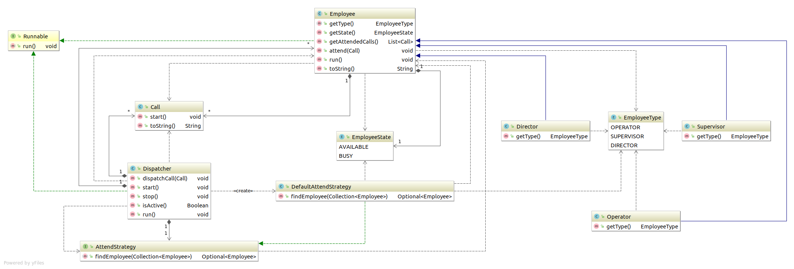

# Call Center

Call Center with different types of employees where they have a priority to attend the calls. The employees type are:

* Operator
* Supervisor
* Director

The main objective is to handle incoming calls and assign them to employees through a Dispatcher.

In the event of a call, an available operator must attend it. If no operator is available then an available supervisor must attend it. If no supervisor is available then an available Director must attend it. If no employee is available then the call is left hanging, until there is one available.

## Solution

The program works around a thread pool of 10 concurrent employees attending calls.

If at some point there isn't any available employee, the call is left in a queue waiting to be attended.

## Questions

* What happens with a call when there is no free employee ? 
The call will go to queue and when someone employee is free he will attend it.
* What happens with a call when input more than 10 concurrent calls ?
The call will go to queue and when someone employee is free he will attend it.

## Class Diagram

### Prerequisites

Java JDK 8 and Maven are required to run the project.

### Compiling

In order to compile the program, you need to run the next sentence:

mvn clean install

## Running the tests

mvn clean test

## Author

* **Jose Armando Rivera Martinez**
